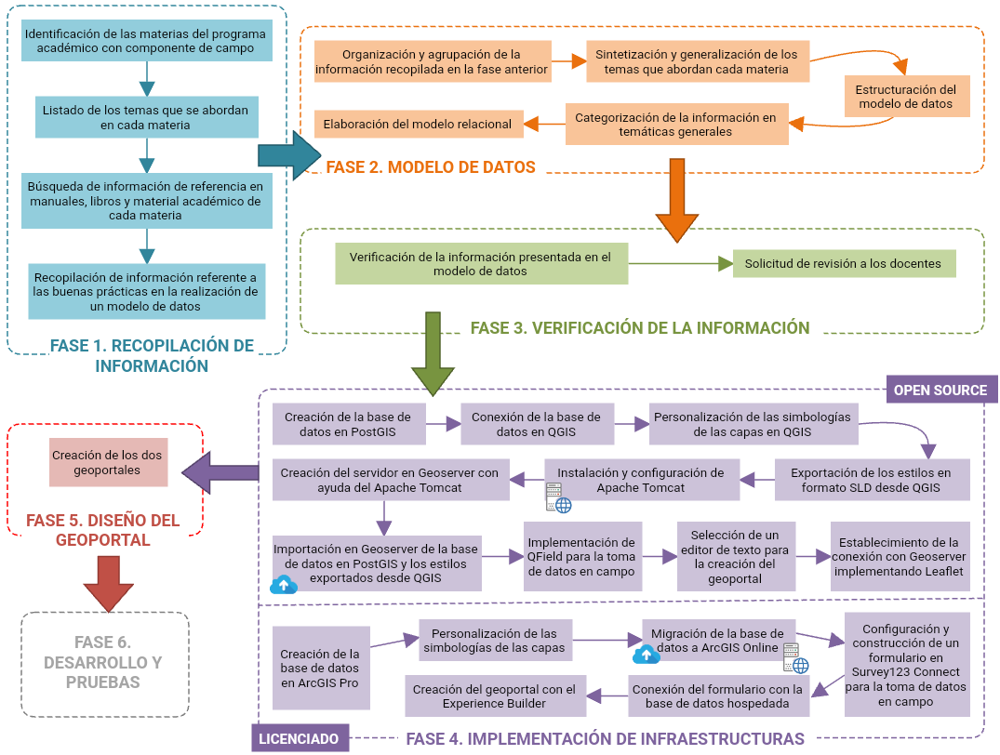

Visita nuestro [sitio](https://julianabarrios.github.io/GeovisorESGEOv1.github.io/) piloto.

  
  

<h1 align="center">Propuesta Metodológica para la Implementación de un Modelo de Datos Geográfico en Entorno SIG y el Diseño de un Geovisor para la Información Geocientífica Generada por la Escuela de Geología</h1>

## Descripción del Proyecto

A través de los años, la Escuela de Geología se ha encargado de llevar a cabo numerosas campañas de campo con el fin de instruir a los nuevos geólogos en las buenas prácticas en la toma de datos y la elaboración de mapas geológicos. Si bien los resultados obtenidos pueden llegar a ser muy diversos, dependiendo de las consideraciones del investigador ya que no se cuenta con un estándar que indique la forma en la cual se debe almacenar la información recolectada, el análisis que se lleva a cabo es muy puntual.

En este sentido, surge el proyecto de crear un repositorio de datos que documente toda esta información recolectada, con el fin de permitir que los datos sean validados o cuestionados; además de compartir esta información con todo el público, desarrollando un geoportal institucional, con el fin de fortalecer la información geocientífica para que pueda ser implementada durante un análisis ambiental o para que pueda servir de referencia como información de diagnóstico para distintos proyectos.

Con el creciente valor de la información geocientífica en investigación y toma de decisiones, surge la necesidad de desarrollar herramientas y plataformas eficientes para su gestión y difusión. Este trabajo propone una metodología integral para implementar un Modelo de Datos Geográfico (MDG) en un entorno de Sistemas de Información Geográfica (SIG) y diseñar un Geovisor especializado, centrándose en la recopilación, organización y visualización eficiente de la información de la Escuela de Geología.

## Tabla de Contenidos

1. [Metodología](#Metodología)
2. [Modelo de Datos Geográfico](#ModelodeDatosGeográfico)
3. [Características](#características)
4. [Contribuir](#contribuir)
5. [Licencia](#licencia)

## Metodología

  

## Modelo de Datos Geográfico

  

## Características

Lista de las principales características del proyecto.

- Recopilación y estandarización de datos geocientíficos.
- Diseño de un Modelo de Datos Geográfico (MDG).
- Implementación en un entorno de Sistemas de Información Geográfica (SIG).
- Desarrollo de un Geovisor para la visualización de datos.
- Infraestructura de Datos Espaciales (IDE).

## Licencia

Este proyecto está licenciado bajo la Licencia MIT - ver el archivo [LICENSE](LICENSE) para más detalles.

